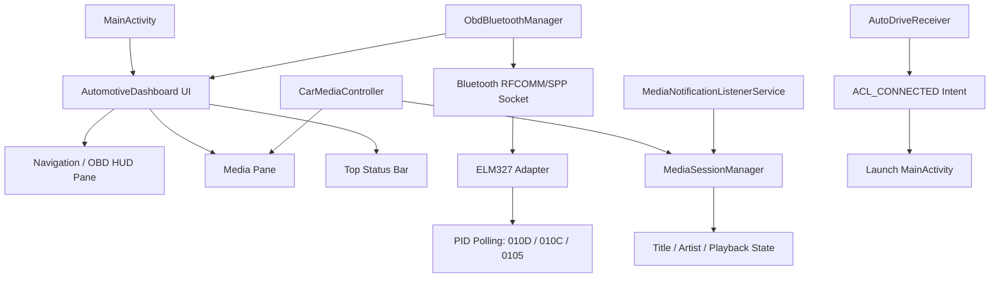

# OpenAuto Dash - Android Car Launcher Project

## Project Overview

OpenAuto Dash is an automotive interface application that functions both as an Android Head Unit Launcher and a standalone smartphone driving app. It is built entirely with Jetpack Compose for a driver-focused UI.

### Key Features
- **Responsive Layout**: 50/50 split that adapts to landscape (head units) or portrait (vertical phone mounts)
- **OBD-II Telemetry**: Real-time speed, RPM and coolant temperature via a Bluetooth ELM327 adapter
- **Media Integration**: Reads the active system media session (title, artist, playback) and exposes transport controls
- **Auto-Launch**: Can launch when the car's Bluetooth device connects, and can be set as the device Home launcher
- **Safety First**: Dark theme (#0F1115), large touch targets (48–72dp), screen kept on while driving

### Project Structure

```
D:/android car launcher/
├── build.gradle.kts                              # Root build: AGP + Kotlin plugin versions
├── settings.gradle.kts                           # Project + repositories
├── gradle.properties                             # AndroidX / Gradle flags
├── gradlew, gradlew.bat                           # Gradle wrapper scripts
├── gradle/wrapper/gradle-wrapper.properties       # Pins Gradle 8.6 (jar generated on first sync/CI)
├── app/
│   ├── build.gradle.kts                           # Module dependencies & Android config
│   ├── proguard-rules.pro
│   └── src/main/
│       ├── AndroidManifest.xml                    # Launcher + HOME filters, permissions, services
│       ├── java/com/openauto/dash/
│       │   ├── MainActivity.kt                    # Entry point + wake flags + Compose theme
│       │   ├── AutomotiveDashboard.kt             # Responsive Jetpack Compose UI
│       │   ├── ObdBluetoothManager.kt             # ELM327 RFCOMM telemetry (speed/RPM/coolant)
│       │   ├── CarMediaController.kt              # MediaSessionManager bridge
│       │   ├── MediaNotificationListenerService.kt # Grants access to read media sessions
│       │   └── AutoDriveReceiver.kt               # Auto-launch on Bluetooth connect
│       └── res/
│           ├── drawable/                          # Vector icons + adaptive-icon layers
│           ├── mipmap-anydpi-v26/ic_launcher.xml  # Adaptive launcher icon (+ ic_launcher_round)
│           ├── values/                            # colors.xml, themes.xml, strings.xml
│           └── xml/receiver.xml
└── .github/workflows/                            # GitHub Actions CI/CD
    ├── build.yml                                 # Builds the debug APK on push/PR
    └── lint.yml                                  # Android Lint + unit tests
```

## Toolchain

| Tool | Version |
|------|---------|
| Java (JDK) | 17 |
| Gradle | 8.6 |
| Android Gradle Plugin | 8.2.2 |
| Kotlin | 1.9.22 |
| Compose Compiler | 1.5.8 |
| compileSdk / targetSdk | 34 |
| minSdk | 29 (Android 10) |

## Setup Instructions

### Prerequisites
1. **Android Studio Hedgehog (2023.1.1) or newer**
2. **Java JDK 17**
3. **Android SDK** (platform 34, build-tools 34, platform-tools)

### Building with Android Studio
1. Open `D:/android car launcher` in Android Studio.
2. Let Gradle sync — this downloads dependencies and generates the Gradle wrapper JAR automatically.
3. Build the debug APK: `Build → Build Bundle(s) / APK(s) → Build APK(s)`.
4. Install `app/build/outputs/apk/debug/app-debug.apk` on a device or emulator.

### Building from the command line
The wrapper JAR (`gradle/wrapper/gradle-wrapper.jar`) is intentionally **not** committed. Generate it once with a locally installed Gradle (8.x), or let Android Studio create it on first sync:

```bash
gradle wrapper --gradle-version 8.6
```

Then build:

```bash
./gradlew assembleDebug
```

On Windows PowerShell use `.\gradlew.bat assembleDebug`. The output APK is at `app/build/outputs/apk/debug/app-debug.apk`.

> If you don't want to install Gradle locally at all, just push to GitHub — the CI build below provisions Gradle, generates the wrapper, and produces the APK for you.

## Features Overview

### 1. Responsive 50/50 Layout (Jetpack Compose)
`AutomotiveDashboard` uses `BoxWithConstraints` to detect orientation:
- **Landscape** (head units & horizontal mounts): left = Navigation/OBD HUD pane, right = Media pane.
- **Portrait** (vertical phone mounts): top = Navigation/OBD HUD pane, bottom = Media pane.

A top status bar shows the app name, clock, and live OBD connection state.

### 2. OBD-II Bluetooth Telemetry
`ObdBluetoothManager` connects to an ELM327 adapter over the Serial Port Profile (SPP) RFCOMM channel and polls standard PIDs:
- **Speed**: PID `01 0D` → km/h (turns red above 110 km/h)
- **RPM**: PID `01 0C` → engine revolutions per minute
- **Coolant Temp**: PID `01 05` → °C

Telemetry and connection state are exposed as `StateFlow`s the UI collects. Tapping **Connect OBD** requests Bluetooth permission (Android 12+), connects to a paired adapter whose name contains `OBD`/`ELM`/`327`, or opens Bluetooth settings to pair one.

### 3. System Media Integration
`CarMediaController` bridges Android's `MediaSessionManager` into a `StateFlow<MediaState>`:
- Reads title, artist and playback state from the active media session of other apps.
- Exposes Play/Pause, Skip Next and Skip Previous (high-contrast 64–72dp touch targets).

Reading other apps' sessions requires **Notification access**, granted once via system settings — the app provides a **Grant Media Access** button and an empty `MediaNotificationListenerService` as the grant target.

### 4. Auto-Launch on Car Bluetooth Connection
- `AutoDriveReceiver` listens for `BluetoothDevice.ACTION_ACL_CONNECTED`.
- When the saved car device connects, it launches `MainActivity`.
- `MainActivity` also declares a `HOME` intent-filter, so it can be selected as the device Home launcher on a head unit.

## Architecture



## Safety Guidelines
- **Dark Theme (#0F1115)**: Reduces glare while driving.
- **High-Contrast Controls**: 48dp minimum touch targets → up to 72dp for media.
- **FLAG_KEEP_SCREEN_ON**: Screen stays awake while the vehicle is running.
- **Large Typography**: Speedometer uses a 96sp readout with a warning threshold.

## Permissions Required

| Permission | Purpose |
|------------|---------|
| BLUETOOTH / BLUETOOTH_ADMIN | Legacy OBD-II adapter connection (≤ Android 11) |
| BLUETOOTH_CONNECT / BLUETOOTH_SCAN | Android 12+ Bluetooth pairing & connection |
| ACCESS_FINE_LOCATION / ACCESS_COARSE_LOCATION | Maps / location features |
| INTERNET | Maps tiles & media streaming |
| WAKE_LOCK / DISABLE_KEYGUARD | Keep screen on while driving |
| FOREGROUND_SERVICE / FOREGROUND_SERVICE_DATA_SYNC | Continuous telemetry service |
| POST_NOTIFICATIONS | Notifications on Android 13+ |
| Notification access (granted in Settings) | Read active media sessions from other apps |

## Testing Checklist

- [ ] `AndroidManifest.xml` declares a `MAIN`/`LAUNCHER` filter and a `MAIN`/`HOME`/`DEFAULT` filter
- [ ] `MainActivity` sets `FLAG_KEEP_SCREEN_ON` on the window
- [ ] `AutomotiveDashboard` uses `BoxWithConstraints` for the responsive 50/50 split
- [ ] `ObdBluetoothManager` connects to an ELM327 over an RFCOMM/SPP socket
- [ ] `CarMediaController` exposes a `StateFlow<MediaState>` with title/artist/isPlaying
- [ ] `AutoDriveReceiver` listens for the `ACL_CONNECTED` intent filter
- [ ] Adaptive launcher icon present at `res/mipmap-anydpi-v26/`

## GitHub Actions CI/CD

The project builds automatically on GitHub Actions — no local Android Studio required.

### Workflow Files
- **`.github/workflows/build.yml`** — builds the debug APK on every push/PR to `main` and uploads it as an artifact.
- **`.github/workflows/lint.yml`** — runs Android Lint and unit tests.

### How It Works
Each job: checkout → set up JDK 17 → set up Android SDK → **set up Gradle 8.6** → `gradle wrapper` (generates the wrapper JAR) → `./gradlew assembleDebug`. Because CI provisions Gradle itself, the wrapper JAR does not need to be committed.

### Download the APK
1. Visit https://github.com/deviloufr-ai/ACP/actions
2. Open a successful **Build Android APK** run.
3. Download the `openauto-dash-apk` artifact.
4. Install on a device: `adb install app-debug.apk`

## Troubleshooting

### OBD-II Connection Issues
1. Pair the ELM327 adapter with the phone in Bluetooth settings first.
2. Grant Bluetooth permission when the app prompts (Android 12+).
3. Ensure the adapter's name contains `OBD`, `ELM`, or `327` so auto-detect finds it.
4. Confirm it works with a known OBD-II app before debugging here.

### Media Controls Not Working
1. Play audio/video from a supported app so there is an active media session.
2. Tap **Grant Media Access** and enable Notification access for OpenAuto Dash.
3. Return to the app — title/artist and transport controls should appear.

### Auto-Launch Not Triggering
1. Save the car's Bluetooth MAC (see `CarBluetoothHelper` in `AutoDriveReceiver.kt`).
2. Note that Android restricts implicit `ACL_CONNECTED` broadcasts to foreground/allow-listed apps on newer versions.
3. Verify Bluetooth actually fires the connection event (test with another app).

## License
Created for educational and demonstration purposes.

## Support
- [Jetpack Compose Guidelines](https://developer.android.com/jetpack/compose)
- [OBD-II PIDs](https://en.wikipedia.org/wiki/OBD-II_PIDs)
- [MediaSessionManager](https://developer.android.com/reference/android/media/session/MediaSessionManager)

---

**Project Status**: Compiles to a debug APK via Gradle/CI; ready for on-device integration testing.

**Last Updated**: 2026-09-17
