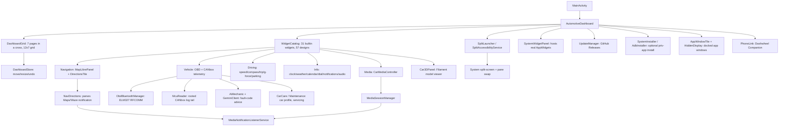

# Dashwheel - Android Car Launcher Project

## Project Overview

Dashwheel is a free-placement, widget-grid car launcher for Android — usable both as a Head Unit's Home launcher and as a standalone smartphone driving app. Built entirely with Jetpack Compose.

The dashboard is **seven swipeable pages laid out as a cross** — a row of three, plus two above and two below the middle one — each a 12×7 cell grid. Each cell can hold an app shortcut, a pair of apps launched side-by-side (split-screen), an editable app launch bar, a docked app window (e.g. Google Maps), a real Android AppWidget, or one of 31 built-in cards (navigation, OBD/vehicle telemetry, car care, driving instruments, media, info & comms, a 3D car model). Tiles are placed, dragged and resized freely down to a single cell, each with its own zoom and its own visual design, with collision-aware move/swap/nudge and full undo.

### Key Features
- **Free-placement widget dashboard**: 7 pages arranged as a cross (swipe sideways along the middle row, up/down from the centre page), 12×7 grid, drag-to-move / handle-to-resize tiles down to 1×1, per-tile zoom (50–200 %), 30-step undo, layout persisted as JSON. The launcher starts on the centre page and the Home key brings you back to it; a small cross indicator shows where you are for 2 s after each page change
- **31 built-in widgets**: navigation map, Google/Waze directions, Maps window dock, full OBD + CANbox telemetry (incl. DTC scan/clear), car-care tiles (particle filter, warm-up, battery, eco driving, break reminder, fuel to destination, My car, servicing), fuel prices nearby, driving instruments (speed/compass/trip/g-force/parking), weather, calendar, quick-dial, notifications, audio, 3D car model, clock, and more — grouped by category in the widget catalogue
- **57 tile designs**: every built-in widget can be restyled per tile — Standard, 15 generic designs (Hero, LCD, Neon, Glass, Carbon sport, Split-flap, Orb, Liquid, Dot matrix, Poster, Duo, Island…) and 41 designs made for a specific widget (thermometer, fuel tank, speed tape, road signs, twin dials, rotary phone, vinyl, cassette, hourglass…), each drawn live even while the widget has no reading
- **Car profile & AI mechanic**: name your car and AI (Gemini) fills in its specs (engine, gearbox, oil, tyres, service intervals, known weak points); fault codes are explained by an AI mechanic whose severity is floored by safety rules, and you can ask it a question out loud
- **Car care & servicing**: particle-filter regeneration coaching, cold-engine rev warnings, battery charge watch (no false alarms from clone adapters), eco-driving score, break reminders, range-vs-destination check, and a servicing planner that counts down each maintenance item from your mileage
- **Fuel prices nearby**: the cheapest stations within 15 km for your fuel, with station name, town and distance — tap to navigate (French government open data, France only)
- **Advanced readings (experimental)**: AI proposes the car maker's own diagnostic requests (particle-filter soot load, temperature, regeneration…) and keeps only the ones the car answers plausibly
- **Speed correction**: a −20 to +20 km/h offset applied to the OBD speed everywhere
- **In-app navigation**: a free MapLibre GL map (CARTO basemap, Nominatim geocoding, Valhalla routing, 3D buildings) that hands off turn-by-turn to Google Maps/Waze; a Directions tile parses the live turn-by-turn notification from either app
- **OBD-II + CANbox telemetry**: ELM327 Bluetooth adapter for speed/RPM/coolant/intake/throttle/load/fuel/voltage plus DTC read & clear; an optional rooted CANbox (MCU) reader for door state and a learned fuel-level mapping, tuned for a Citroën C4 Picasso
- **System split-screen**: docks the dashboard and launches another app (or a saved pair) beside it via an Accessibility Service, with a swap button/overlay to flip which app is on which side
- **System AppWidget hosting**: embed real Android widgets (including ones like Google Maps' that Android normally hides from non-launcher pickers) inside dashboard tiles
- **Docked app windows**: a tile can host a live app window (typically Google Maps); when its page is left the window is moved onto a private hidden display instead of being closed or covered, and comes back size, place and state intact
- **14 visual themes**: Auto, Original, Aurora Glass, Neon Dark, Clean Light, Dark Glass, Sporty, Floating, Mistral (central instrument-cluster bar) and Zénith (lounge cabin), plus four whole-design skins (Orbit, Cockpit, Horizon, Tape Deck) with their own backgrounds, top bars and widgets — picked from a gallery of live mini-dashboards, with solar day/night switching and an Effects level (None / Reduced / Full) for bright sunlight
- **Full-screen Settings**: two-column Settings screen (Car, Appearance, Driving, Advanced) reached from the grouped ⋮ menu; app available in 8 languages (English, French, Italian, German, Spanish, Portuguese, Polish, Dutch)
- **Boot logo**: put your car's brand on the head unit's start-up animation (387 makes; QF001 / ROCO K706 UIS7862 firmware)
- **Phone link (Dashwheel Companion)**: with the phone sharing its connection over Wi-Fi, a small companion app on the phone sends its notifications and messages to the Notifications widget; read them aloud and answer with a quick reply or by voice (WhatsApp, Messages, Signal… through each app's own reply action, like Android Auto); incoming calls with caller name and photo, answer / decline / hang up from the screen. Paired once by scanning a QR code, end-to-end encrypted. Notifications can be swiped away like on Android
- **Where's my car**: while linked, the head unit sends the car's position at every stop; the companion app shows where the car was parked and when, with a walking route in Google Maps
- **Media Integration**: reads the active system media session (title, artist, artwork, playback) and exposes transport controls; Play with no player open starts the last music app. The Audio tile's volume buttons also drive head units that ignore Android's volume
- **In-App Auto-Update**: checks GitHub Releases on launch, tracks the installed version, and downloads/installs newer APKs
- **Optional priv-app install**: self-installs to `/system/priv-app` (via `su`/Magisk or the head unit's internal root ADB) to pick up `BIND_APPWIDGET` privileges and the split-swap overlay — opt-in only, not required
- **Safety First**: dark themes by default, a driving type scale (nothing under 14 sp), 48 dp touch targets, a drive lock that closes editing and settings above 8 km/h, spoken vehicle alerts, screen kept on while driving
- **Lighter and faster**: only the tiles whose data changed are redrawn, animated skin backgrounds are cached, the app is compiled ahead of time after each update, and the update APK is 47 MB instead of 84 MB

### Project Structure

```
D:/android car launcher/
├── build.gradle.kts                              # Root build: AGP 8.13.2 + Kotlin 2.1.0 plugin versions
├── settings.gradle.kts                           # Project + repositories
├── gradle.properties                             # AndroidX / Gradle flags
├── gradlew, gradlew.bat                           # Gradle wrapper scripts
├── gradle/wrapper/gradle-wrapper.properties       # Pins Gradle 8.13 (jar generated on first sync/CI)
├── app/
│   ├── build.gradle.kts                           # Module dependencies & Android config
│   ├── proguard-rules.pro
│   └── src/main/
│       ├── AndroidManifest.xml                    # Launcher + HOME filters, permissions, services
│       ├── assets/car.glb                         # 3D car model for the Car3D widget
│       ├── java/com/openauto/dash/
│       │   ├── MainActivity.kt                    # Entry point, wake flags, multi-window tracking
│       │   ├── AutomotiveDashboard.kt             # Root composable: pages, undo, OBD loop, dialogs
│       │   ├── DashboardModel.kt                  # Grid model, DashboardItem/BuiltinKind, persistence
│       │   ├── DashboardGrid.kt                   # Grid rendering, drag-move / drag-resize gestures
│       │   ├── WidgetCatalog.kt                   # "+" add-widget picker, grouped by category
│       │   ├── WidgetDesigns.kt / WidgetDesignPicker.kt / WidgetFaces*.kt / WidgetSignatures.kt # 57 per-tile designs + picker
│       │   ├── AppWindowTile.kt / DockPolicy.kt / HiddenDisplay.kt # Docked app windows; parking them on a hidden display
│       │   ├── SettingsScreen.kt / ThemePane.kt   # Full-screen Settings + theme gallery
│       │   ├── DashTokens.kt / DashType.kt / DayNight.kt # Shape/spacing tokens, driving type scale, solar day/night
│       │   ├── DriveLock.kt / VehicleAlerts.kt    # Editing locked while moving; amber/red spoken vehicle alerts
│       │   ├── CarProfile.kt / CarSpecs.kt / CarCare.kt / CarCareTiles.kt # My car (AI specs) + car-care tiles
│       │   ├── Maintenance.kt / MaintenanceTiles.kt # Servicing planner
│       │   ├── FuelPrices.kt / FuelPricesTile.kt  # Cheapest fuel nearby (French open data)
│       │   ├── AiMechanic.kt / MechanicVerdict.kt / AskMechanic.kt / GeminiClient.kt # AI mechanic: fault-code advice, safety floor, voice questions
│       │   ├── PidExplorer.kt / PidExplorerDialog.kt # Advanced readings: maker-specific diagnostic requests
│       │   ├── SpeedCorrection.kt                 # OBD speed offset
│       │   ├── BootAnimation.kt / BootLogoDialog.kt / CarBrands.kt # Boot logo with the car's brand
│       │   ├── AppLauncher.kt / AppTiles.kt       # App enumeration + full-screen app drawer
│       │   ├── TopBar.kt                          # Minimal bar: Apps, layout menu, clock, OBD pill, alerts, grouped ⋮ menu
│       │   ├── DashTheme.kt                       # 14 palettes (incl. Aurora Glass, Mistral, Zénith)
│       │   ├── Skins.kt / SkinKit.kt              # Skin dispatch (background, top bar, widgets, Maps frame) + shared live values
│       │   ├── OrbitSkin.kt / CockpitSkin.kt / HorizonSkin.kt / TapeDeckSkin.kt  # The four whole-design skins
│       │   ├── WindowFrameOverlay.kt              # Skin frame drawn in an overlay window over the docked Google Maps window
│       │   ├── OriginalTiles.kt                   # Legacy widget renderers used by the "Original" theme
│       │   ├── MapLibrePanel.kt                   # In-app MapLibre GL navigator (free, no API key)
│       │   ├── DirectionsTile.kt / NavDirections.kt # Google Maps/Waze turn-by-turn via notification parsing
│       │   ├── Car3DPanel.kt                      # Filament-rendered 3D car model (assets/car.glb)
│       │   ├── ObdBluetoothManager.kt / ObdParser.kt / ObdCodes.kt # ELM327 link, pure reply decoding, DTC table
│       │   ├── McuReader.kt                       # Rooted CANbox reader: doors, learned fuel mapping
│       │   ├── TelemetryTiles.kt / VehicleTiles.kt / DriveTiles.kt # OBD/CANbox/driving-instrument cards
│       │   ├── CarMediaController.kt / MediaTile.kt # MediaSessionManager bridge + media card
│       │   ├── MediaNotificationListenerService.kt  # Shared listener: media + directions + notifications
│       │   ├── InfoTiles.kt / WeatherRepo.kt       # Clock/weather/calendar/dial/notifications/audio cards
│       │   ├── SystemWidgetPanel.kt               # Hosts real Android AppWidgets inside dashboard tiles
│       │   ├── SplitLauncher.kt / SplitAccessibilityService.kt # System split-screen + pane swap
│       │   ├── AdbInstaller.kt / SystemInstaller.kt # Optional priv-app self-install (Magisk / root ADB)
│       │   ├── PhoneLink.kt / PhoneLinkUi.kt       # Phone link: dials the companion app on the hotspot, reply sheet, pairing QR
│       │   ├── CarWhereabouts.kt                  # Sends the car's stops to the companion ("Where's my car")
│       │   ├── PhoneCallOverlay.kt                # The phone's calls: caller card with answer / decline / hang up, over any app
│       │   ├── UpdateManager.kt                   # GitHub Releases auto-update
│       │   └── AutoDriveReceiver.kt               # Auto-launch on Bluetooth connect (see Troubleshooting)
│       └── res/
│           ├── drawable/                          # Vector icons + adaptive-icon layers
│           ├── mipmap-anydpi-v26/ic_launcher.xml  # Adaptive launcher icon (+ ic_launcher_round)
│           ├── values/                            # colors.xml, themes.xml, strings.xml
│           └── xml/                               # file_paths.xml, split_accessibility_config.xml
│   └── src/test/java/com/openauto/dash/       # JVM unit tests: grid, OBD decoding, directions, layout JSON
├── companion/                                    # Dashwheel Companion, the phone app (notification listener + link server)
├── link/                                         # Plain-Kotlin protocol shared by both apps: messages, pairing, encrypted channel (+ tests)
└── .github/workflows/                            # GitHub Actions CI/CD
    ├── build.yml                                 # Builds the APKs; releases from main, pre-releases from branches, prunes old ones
    └── lint.yml                                  # Android Lint + unit tests
```

## Toolchain

| Tool | Version |
|------|---------|
| Android Gradle Plugin | 8.13.2 |
| Gradle | 8.13 |
| Kotlin | 2.1.0 (+ Compose compiler plugin) |
| compileSdk | 35 |
| targetSdk | 34 |
| minSdk | 29 (Android 10) |
| Gradle JDK | 17–21 (see note) |

> **JDK note:** AGP 8.13.2 / Gradle 8.13 run on JDK 17–21, not JDK 25. The latest Android Studio bundles JBR 25 for the IDE, but the **Gradle JDK** is a separate, per-project setting. If Studio flags "Java 25 is not supported", set **Settings → Build, Execution, Deployment → Build Tools → Gradle → Gradle JDK → Download JDK → 21** and re-sync. The IDE keeps using JBR 25; only the Gradle daemon uses 21.

## Setup Instructions

### Prerequisites
1. **Android Studio (latest)** with a **Gradle JDK of 17–21** (Studio can download it)
2. **Android SDK** (platform 35, build-tools 35, platform-tools)

### Building with Android Studio
1. Open `D:/android car launcher` in Android Studio.
2. Let Gradle sync — this downloads dependencies and generates the Gradle wrapper JAR automatically. If it complains about Java 25, set the Gradle JDK to 21 (see the JDK note above) and re-sync.
3. Build the debug APK: `Build → Build Bundle(s) / APK(s) → Build APK(s)`.
4. Install `app/build/outputs/apk/debug/app-debug.apk` on a device or emulator.

### Building from the command line
The wrapper JAR (`gradle/wrapper/gradle-wrapper.jar`) is intentionally **not** committed. Generate it once with a locally installed Gradle (8.13), or let Android Studio create it on first sync:

```bash
gradle wrapper --gradle-version 8.13
```

Then build:

```bash
./gradlew assembleDebug
```

On Windows PowerShell use `.\gradlew.bat assembleDebug`. The output APK is at `app/build/outputs/apk/debug/app-debug.apk`.

> If you don't want to install Gradle locally at all, just push to GitHub — the CI build below provisions Gradle, generates the wrapper, and produces the APK for you.

## Features Overview

### 1. Dashboard Grid — 7 Pages in a Cross, Free Placement
`AutomotiveDashboard` owns seven "virtual desktop" pages arranged as a cross: a row of three you swipe sideways, and two pages above and two below the middle one you reach by swiping up or down (a sideways swipe on those brings you back to the middle row). Each page is a 12×7 cell grid (`DashboardModel.kt`). The launcher starts on the centre page and Android's Home key closes the app drawer, Settings or edit mode and returns there. After a page change a small indicator draws the cross with the current page filled in and its name, then fades out after 2 s.

Tiles are placed, long-press-dragged to move, or resized via a corner handle (`DashboardGrid.kt`) down to a single cell, with live snap-preview and collision-aware move/swap/nudge (`DashboardStore.moveResolving`). While arranging, each tile has a zoom menu that scales its text, icons and spacing from 50 % to 200 %. Layouts persist as JSON in SharedPreferences and survive app restarts; up to 30 steps of undo are kept in memory. Tapping the **"+"** tile opens the add flow: an app shortcut, a split-screen app pair, an editable launch bar, a widget from the catalogue, or a hosted system AppWidget.

While the launcher shares the screen with another app (system split-screen), pages automatically switch to a stacked vertical-scroll layout instead of the free grid.

### 2. Widget Catalogue (31 built-in cards) and Tile Designs
`WidgetCatalog.kt` groups every built-in widget by category:
- **Driving**: speed HUD, compass, trip computer, g-force meter, eco-driving score, break reminder
- **Navigation**: in-app MapLibre map, Google/Waze directions tile, Maps window dock (pins the floating Maps window onto a tile via the head unit's ADB socket), parking spot, fuel to destination, fuel prices nearby
- **Vehicle**: OBD telemetry, fault codes (DTC scan/clear with AI explanation), all-OBD-values, fuel/range (incl. the car's own range from the CANbox), door state, CAN signal monitor, 3D car model, particle filter, engine warm-up, battery, My car, servicing
- **Info & Comms**: clock, weather, calendar, quick-dial, notifications (swipe left or right to dismiss)
- **Media & Apps**: media player, audio (− / + volume; on head units that ignore Android's volume the keys are pressed like the rotary knob, and un-mute raises a volume left at 0)

**Per-tile designs** (`WidgetDesigns.kt`, `WidgetDesignPicker.kt`): in edit mode the palette button on a built-in tile opens a picker previewing each design with the widget's live reading at the tile's proportions. There are 57: **Standard**, 15 generic designs (Hero, LCD, Amber terminal, Neon, E-ink, Glass, Carbon sport, Chronograph, Split-flap, Orb, Liquid, Dot matrix, Poster, Duo, Island) and 41 designs made for what a widget measures — a thermometer, fuel tank, battery cell, speed tape, road signs, twin dials and shift lights, compass rose, friction circle, parking radar, odometer, the car seen from above with its open doors, sun path, binary clock, rotary phone, vinyl and cassette, the particle filter's honeycomb, an hourglass… The designs made for a widget are listed first. Every design draws in every state: with no reading it shows "--", the reason (OBD not connected, access needed, waiting for GPS…) and the button that fixes it. The design is saved with the tile.

### 3. In-App Navigation & Directions
`MapLibrePanel.kt` is a free, no-API-key in-app navigator: MapLibre GL rendering over the CARTO dark-matter basemap, Nominatim geocoding, Valhalla routing, and 3D building extrusion, with a GPS-tracking camera. Tapping **Start** hands off turn-by-turn guidance to Google Maps via the free `google.navigation:` intent (falling back to a generic `geo:` intent) — full embedded Google Maps was attempted but abandoned since embedding requires platform signing.

`NavDirections.kt` reads the ongoing turn-by-turn notification Google Maps/Waze post while navigating (via the same notification-listener service used for media) and parses instruction text, distance and ETA — even when the notification uses a custom RemoteViews layout with empty extras. `DirectionsTile.kt` renders this as a full card or as a compact banner floated over the map tile.

### 4. OBD-II + CANbox Vehicle Telemetry
`ObdBluetoothManager.kt` connects to an ELM327 adapter over Bluetooth SPP/RFCOMM and polls every 500ms: speed, RPM, coolant/intake temp, throttle, engine load, fuel level, and control-module voltage, plus **DTC read & clear** (mode 03/04) with human-readable descriptions from `ObdCodes.kt` (extra detail for Citroën C4 Picasso VTi/THP/HDi engines).

`McuReader.kt` optionally taps the head unit's CANbox/MCU (requires root, tails `logcat -s mcu_services`) to expose live door/bonnet/tailgate state and a user-calibrated fuel-level mapping for vehicles whose OBD doesn't report fuel.

### 5. System Media Integration
`CarMediaController.kt` bridges Android's `MediaSessionManager` into a `StateFlow<MediaState>`, auto-selecting whichever session is actually playing, exposing title/artist/artwork/duration and Play/Pause/Next/Previous transport controls. With no media session at all, Play opens the last music app seen playing (or the system's default player) and starts it. Reading other apps' sessions requires **Notification access**, granted once via system settings — the same listener service also powers the Directions tile and a general notifications feed.

### 6. System Split-Screen + Pane Swap
This head unit's ROM ignores AOSP windowing APIs but honors SystemUI's manual recents-drag split path, so `SplitLauncher.kt` drives it via an `AccessibilityService` (`SplitAccessibilityService.kt`, enabled once under Settings → Accessibility): it triggers the same global action a manual split gesture would, then launches the target app (or a saved pair) adjacent to the dashboard. A floating overlay button (or a FAB in the dashboard) lets you swap which app occupies which side, since this ROM has no working divider double-tap swap gesture.

### 7. Optional Priv-App Install
`SystemInstaller.kt`/`AdbInstaller.kt` can self-install the APK into `/system/priv-app`, either via `su`/Magisk (preferring a systemless Magisk module) or by talking to the head unit's internal root ADB socket. This is opt-in only (from ⋮ → System app in the top bar), mainly useful for the `BIND_APPWIDGET` priv-app permission and the split-swap overlay window — it does **not** enable embedding Google Maps.

### 8. Phone Link (Dashwheel Companion)
The driver's phone shares its connection with the head unit over Wi-Fi. **Dashwheel Companion** (`companion/`, shipped as `dashwheel-companion.apk` in every release) runs on the phone:
- A `NotificationListenerService` reads the phone's notifications, including messaging conversations (`MessagingStyle`), and answers them through each app's own reply / mark-as-read actions (`RemoteInput`), the same ones Android Auto and smartwatches use.
- A foreground service listens on TCP port 47810. The launcher's `PhoneLink` finds the phone at the Wi-Fi network's default gateway (Android 11+ randomises the hotspot subnet), dials it, and redials whenever the network changes.
- **Pairing**: Settings → Phone → *Pair a phone* shows a QR code (`dashwheel://pair?…`) carrying a random 32-byte secret. The phone scans it and the driver confirms. Every connection then proves both sides hold that secret (HMAC over the handshake), agrees fresh keys with ephemeral ECDH P-256, and encrypts every frame with AES-256-GCM (`link/`, unit-tested). Either side can revoke the pairing.
- On the head unit, the phone's notifications join the Notifications widget. Tapping one opens a sheet to read it aloud, answer with a quick reply or dictation, mark it read or clear it on the phone.
- **Where's my car**: while the phone is linked, the head unit (`CarWhereabouts.kt`) sends the car's position at every stop, and the parking spot saved on the Parking tile too. The last stop before the ignition goes off is the parking spot: the companion app shows it on a card with the time the car was left, and buttons to open the map or walk there in Google Maps. The position stays on the phone only.
- A status line under the link state on both devices says what happened last (address dialled and answer on the head unit, what was received on the phone). The phone only accepts connections arriving on its own hotspot, never from its Wi-Fi, mobile data or a VPN.
- **Calls**: the companion follows the phone's call state (`PHONE_STATE`), finds the caller in the contacts, and answers or ends the call through `TelecomManager` when asked (`PhoneCalls.kt`). On the head unit, `PhoneCallOverlay` shows a card with the caller, *Answer* and *Decline*, then a slim bar with the duration and *Hang up*. It is its own overlay window, so it appears over any full-screen app (needs "display over other apps", granted through the head unit's shell when possible, otherwise from Settings → Phone); without it, a popup over the launcher. The call's **sound stays on the head unit's Bluetooth hands-free**: pair the phone with the head unit's Bluetooth as well.

On Android 13+, a sideloaded app's Notification access is a "restricted setting": on the phone, open App info → ⋮ → *Allow restricted settings* first. The companion app shows this step.

### 9. In-App Auto-Update
`UpdateManager` keeps the app current from GitHub Releases:
- On launch it queries `https://api.github.com/repos/deviloufr-ai/ACP/releases/latest`.
- **Version tracking**: the installed `versionCode` is set by CI to the Actions **run number**; the latest build number is parsed from the release tag (`v1.0.42` → `42`). A higher number means an update is available.
- If newer, a banner offers **Update** → it downloads the release's launcher APK (never `dashwheel-companion.apk`) via `DownloadManager` and launches the system installer (Android always shows its own install confirmation).
- The current version is shown in the top status bar.

> Android cannot install silently without device-owner privileges, so "auto-update" means auto-check + auto-download + a one-tap, OS-confirmed install. The first time, the user must allow "install unknown apps" for Dashwheel (the app opens that settings screen for them).

**Important — signing:** an update APK can only replace the installed app if both are signed with the **same key**. CI's debug key is regenerated every run, so you must add a persistent release keystore (below) for updates to actually install over each other.

#### Release signing setup (required for OTA updates)
1. Generate a keystore once:
   ```bash
   keytool -genkeypair -v -keystore release.keystore -alias openauto \
     -keyalg RSA -keysize 2048 -validity 10000
   ```
2. Base64-encode it:
   ```bash
   base64 -w0 release.keystore > release.keystore.b64   # Linux
   # macOS: base64 -i release.keystore -o release.keystore.b64
   ```
3. In the GitHub repo, add **Settings → Secrets and variables → Actions**:
   - `KEYSTORE_BASE64` — contents of `release.keystore.b64`
   - `KEYSTORE_PASSWORD` — the store password
   - `KEY_ALIAS` — `openauto`
   - `KEY_PASSWORD` — the key password

When these secrets are present, CI signs every release APK with that key; when they are absent, it falls back to the debug key (installs fine, but cross-version updates won't).

### 10. Theming
`DashTheme.kt` provides 14 selectable themes, switchable live from the theme gallery in Settings → Appearance (`ThemePane.kt`, which draws each theme as a mini-dashboard, night and day side by side): **Auto** (day only when the system is in day mode *and* the sun is up where the car is — `DayNight.kt`), **Original** (the first launcher look — flat cards, twin-needle gauges, rendered by `OriginalTiles.kt`), **Aurora Glass** (glass panels, glowing gauges, cyan/violet gradient), **Neon Dark**, **Clean Light**, **Dark Glass**, **Sporty** (black + red), **Floating** (no tile backgrounds), **Mistral** (inspired by the C4 Picasso's central cluster: condensed type and a "cluster" top bar with speed in the middle, segmented rev counter, fuel and fluid bars) and **Zénith** (lounge cabin). Each palette carries its hero font and weight; colours cross-fade in 400 ms when the palette changes. An **Effects** setting (None / Reduced / Full) makes every theme opaque and glow-free for full sun and really stops background animations and blurs.

Four more are whole-design **skins** (`DashSkin`): **Orbit** (everything round: a spinning record, ring gauges, bubbles), **Cockpit** (chrome-ringed analog dials and toggle switches on stitched leather), **Horizon** (no widgets, just an evening scene with the road ahead and typography on it) and **Tape Deck** (80s synthwave head unit: cassette, neon grid, seven-segment digits). A skin draws its own page background, top bar and the main widgets (speed, telemetry, music, directions, clock, weather, fuel, app shortcuts, launch bar); `Skins.kt` routes those tiles to the skin's file and every other tile keeps its standard renderer on the skin's palette. When Google Maps is docked, the skin also shapes and decorates it (a round porthole, a chrome bezel, a CRT bezel, a soft fade) from an overlay window above it (`WindowFrameOverlay.kt`); touches pass straight through to Maps. The skins' animated backgrounds are drawn once and only their moving parts are updated (up to 90 % less CPU when stationary).

### 11. Car Profile, Car Care and Servicing
**My car** (⋮ → My car): name your car and AI fetches its specs — engine, gearbox, oil, tyres, service interval, known weak points — to check, correct and save (`CarProfile.kt`, `CarSpecs.kt`; preset for the Citroën C4 Picasso 1.6 HDi 110 FAP with the BMP6 gearbox). The profile tailors the car-care tiles (`CarCareTiles.kt`), the fuel range and the AI mechanic:
- **Particle filter**: counts short drives and says when a 20 min drive above 60 km/h is needed to regenerate
- **Engine warm-up**: coolant temperature and the rev limit while cold, with a spoken reminder if you rev a cold engine
- **Battery**: voltage (engine computer only — clone adapters' ATRV readings are ignored), whether it is charging, trip min/max; amber/red alerts only after 30 s of engine running, on a 30 s median
- **Eco driving**: drive score, time in the relaxed rev band, hard acceleration/braking, fuel used and its cost
- **Break reminder**: spoken after 2 hours of driving, then every 30 minutes
- **Fuel to destination**: compares the range with the distance left in Maps or Waze
- **Robotised gearbox (BMP6)**: a reminder to hold the car on the brake, not the accelerator

**Servicing** (`Maintenance.kt`): enter the mileage once and your drives add to it; the maker's service intervals are fetched by AI and each item (oil, brake fluid, timing belt, filter additive…) counts down, and is announced at start-up when it comes due.

**Fuel prices** (`FuelPrices.kt`): the cheapest stations within 15 km for your fuel, with price, station name (OpenStreetMap) and town; tap one to navigate there. Data from the French government's open data, so France only.

**Speed correction** (Settings → Car, or from the telemetry tile): a −20 to +20 km/h offset applied to the OBD speed everywhere.

### 12. AI Mechanic, Fault Codes and Advanced Readings
The **Fault codes** tile reads and clears DTCs (including from adapters that prefix replies with the sender, and never reading a silent engine computer as "no fault"), keeps a history of the last alerts, and has an AI mechanic (`AiMechanic.kt`, `GeminiClient.kt`, optionally with your own Gemini API key) explain each code in the app's language. Its severity is floored by the car's rules (`MechanicVerdict.kt`): misfires, crank sensor, oil pressure, overheating, brakes/ABS, airbag… are never judged harmless whatever the model says. Models are asked from best to lightest, the next one only after 8 s or a refusal. You can also ask the mechanic a question out loud (`AskMechanic.kt`).

**Advanced readings** (⋮ → Advanced readings, experimental — `PidExplorer.kt`): AI proposes the car maker's own diagnostic requests (particle-filter soot load and temperature, regeneration state…), including the reply address and diagnostic session to open (default/extended only, never programming). Each is tried on the adapter and kept only if the car answers with a plausible, steady value; confirmed readings show on the particle-filter tile.

`VehicleAlerts.kt` raises amber alerts while a reading is out of range and red for critical ones, says them once and keeps them on the bar until tapped.

### 13. Docked App Windows
A **Maps window** tile hosts a live app window (usually Google Maps) inside its cell, through the head unit's shell (`AppWindowTile.kt`, `DockPolicy.kt`). When the window has to go — another page, a pop-up over its tile, another app in front — it is moved onto a private virtual display the launcher owns (`HiddenDisplay.kt`, `am display move-stack`), so the app keeps running with nothing of it on screen, then brought back size, place and state intact. If the shell can't move stacks, the window is parked in the bottom-right corner under a small black cover instead. A split pair launched over a tile's window comes up properly split; Maps opened fullscreen at boot is sent back into its tile; the Maps dock divider can be dragged, and the status bar keeps the theme's colours while a window exists.

### 14. Driving Safety, Settings and Languages
- **Drive lock** (`DriveLock.kt`): above 8 km/h (OBD or GPS) editing, templates, settings, pickers and the bar editor close and refuse to open, the app drawer becomes a 64 dp list, and a "Park to make changes" chip answers long presses. Can be turned off in Settings → Advanced.
- **Type and targets** (`DashType.kt`, `DashTokens.kt`): nothing under 14 sp, 16 sp labels, 18 sp body; 48 dp minimum touch targets, 56 dp media previous/next; haptic ticks and an optional beep on key presses.
- **OBD pill**: the bar's OBD status (hollow / filled / pulsing, "!" on error) is the single place to connect the adapter; tiles say *why* a connection fails (Bluetooth off, not paired, refused, no answer…) and let you choose another adapter. Missing adapters are retried with a growing delay, up to once a minute.
- **Settings** (`SettingsScreen.kt`): a full-screen two-column screen — Car, Appearance, Driving, Advanced — reached from the ⋮ menu, which is grouped into Dashboard, Car and Settings with a one-line description under each entry. ⋮ → Check for updates checks on demand.
- **Languages**: English, French, Italian, German, Spanish, Portuguese, Polish and Dutch.

### 15. Boot Logo
⋮ → Boot logo puts your car's make on the head unit's start-up screen (QF001 / ROCO K706, UIS7862 firmware only): pick from 387 makes, preview on black or white with the brand name, then install — the logo fades in, a light sweeps across it and it stays until Android is up. Installs through the unit's internal ADB or Magisk root; *Save to USB* writes it the way the factory menu imports it, and *Restore original* puts everything back.

## Architecture



## Safety Guidelines
- **Dark Themes by Default**: Auto/Aurora/Neon/Dark Glass/Sporty/Mistral/Zénith all reduce glare while driving; Auto follows the sun at the car's position.
- **Drive Lock**: editing and settings close above 8 km/h.
- **High-Contrast Controls**: 48 dp minimum touch targets throughout the grid and media transport.
- **Spoken Alerts**: vehicle alerts, service reminders and break reminders are read aloud; voice alerts only stay silent during a call.
- **Screen Kept On**: the screen stays awake while the dashboard is active.
- **Large Typography**: hero telemetry (speed, distance-to-turn) uses oversized readouts with warning thresholds.

## Permissions Required

| Permission | Purpose |
|------------|---------|
| BLUETOOTH / BLUETOOTH_ADMIN / BLUETOOTH_CONNECT | OBD-II adapter connection |
| ACCESS_FINE_LOCATION / ACCESS_COARSE_LOCATION | In-app navigation, weather, driving-instrument widgets |
| READ_CALENDAR | Calendar widget (requested at runtime when added) |
| READ_CONTACTS | Quick Dial widget (requested at runtime when added) |
| INTERNET | Map tiles, weather, media, updates |
| WAKE_LOCK / DISABLE_KEYGUARD | Keep screen on while driving |
| FOREGROUND_SERVICE / FOREGROUND_SERVICE_DATA_SYNC | Continuous telemetry |
| POST_NOTIFICATIONS | Notifications on Android 13+ |
| REQUEST_INSTALL_PACKAGES | Install downloaded update APKs |
| BIND_APPWIDGET | Hosting real Android AppWidgets in dashboard tiles |
| SYSTEM_ALERT_WINDOW | Floating split-screen swap button; the skins' frame over the docked Maps window (granted through the dock's shell when missing) |
| Notification access (granted in Settings) | Read media sessions, parse Maps/Waze directions, general notifications feed |
| Accessibility service (granted in Settings, optional) | Drive system split-screen + pane swap |

## GitHub Actions CI/CD

The project builds automatically on GitHub Actions — no local Android Studio required.

### Workflow Files
- **`.github/workflows/build.yml`** — builds the **release** launcher APK and the companion APK, uploads them as an artifact, and publishes them: a push to `main` publishes a **GitHub Release** the in-app updater reads; a push to any other branch publishes a **pre-release** (ignored by the updater) to try the branch on the head unit. After publishing it **prunes old releases**: only the three newest releases from `main` and the pre-release that run just published are kept; every other release is deleted with its tag.
- **`.github/workflows/lint.yml`** — runs Android Lint and unit tests.

### How It Works
Each build job: checkout → set up JDK 21 → set up Android SDK (explicit packages, no obsolete `tools`) → **set up Gradle 8.13** → `gradle wrapper` → decode the optional signing key → `./gradlew assembleRelease` (with `VERSION_CODE`/`VERSION_NAME` from the run number) → upload artifact → publish a release tagged `v1.0.<run_number>` (or a pre-release tagged `<branch>-v1.0.<run_number>`) with both APKs attached and release notes built from the commit messages since the previous release → prune old releases. Because CI provisions Gradle itself, the wrapper JAR is not committed.

### Get the APK
- **Latest release** (what the app auto-updates from): https://github.com/deviloufr-ai/Dashwheel/releases/latest — the launcher is `app-release.apk`, the phone app `dashwheel-companion.apk`
- **Per-run artifact**: Actions tab → a successful run → `openauto-dash-apk`.
- Install on a device: `adb install app-release.apk`

## Troubleshooting

### OBD-II Connection Issues
1. Pair the ELM327 adapter with the phone in Bluetooth settings first.
2. Grant Bluetooth permission when the app prompts (Android 12+).
3. Ensure the adapter's name contains `OBD`, `ELM`, or `327` so auto-detect finds it.
4. Confirm it works with a known OBD-II app before debugging here.

### Media / Directions / Notifications Not Working
1. Play audio/video from a supported app, or start turn-by-turn in Google Maps/Waze, so there is an active notification to read.
2. Open the widget's **Grant Media Access** action and enable Notification access for Dashwheel — this one grant powers media, directions, and the notifications feed.
3. Return to the app — the relevant tile should populate.

### Split-Screen / Swap Not Working
1. Enable the accessibility service once under **Settings → Accessibility → Dashwheel**.
2. If the service isn't enabled, split launches fall back to a movable freeform window instead of true split-screen.
3. The swap overlay button needs `SYSTEM_ALERT_WINDOW`; installing as a priv-app auto-grants this on some ROMs.

### Auto-Launch on Bluetooth Connect Is Unreliable
`AutoDriveReceiver` listens for `ACTION_ACL_CONNECTED`, but Android 8+ (this app targets `minSdk 29`) no longer delivers most implicit broadcasts to manifest-declared receivers — this only works if the app process is already running. Treat it as a best-effort convenience, not a guaranteed auto-launch.

## License
Created for educational and demonstration purposes.

## Support
- [Jetpack Compose Guidelines](https://developer.android.com/jetpack/compose)
- [OBD-II PIDs](https://en.wikipedia.org/wiki/OBD-II_PIDs)
- [MediaSessionManager](https://developer.android.com/reference/android/media/session/MediaSessionManager)
- [MapLibre GL Android SDK](https://maplibre.org/maplibre-native/android/)

---

**Project Status**: Compiles to a debug/release APK via Gradle/CI; actively evolving, in on-device integration testing on a real head unit.

**Last Updated**: 2026-09-25
