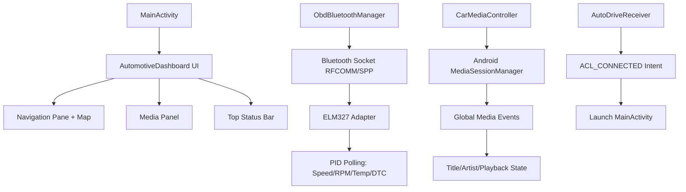

# OpenAuto Dash - Android Car Launcher Project

## Project Overview

OpenAuto Dash is an automotive interface application that functions both as an Android Head Unit Launcher and Standalone Smartphone Driving App. Built with Jetpack Compose for a driver-focused UI experience.

### Key Features
- **Responsive Layout**: 50/50 split adapting to landscape (head units) or portrait (vertical phone mounts)
- **OBD-II Telemetry**: Real-time speed, RPM, coolant temperature monitoring via Bluetooth ELM327 adapter
- **Media Integration**: System media session control with album art and video support
- **Auto-Launch**: Automatically activates when connected to car Bluetooth device
- **Safety First**: Dark theme (#0F1115), large touch targets (48-64dp), screen always on

### Project Structure

```
D:/android car launcher/
├── app/src/main/AndroidManifest.xml              # Launcher declaration + permissions
├── app/src/main/java/com/openauto/dash/
│   ├── MainActivity.kt                           # Entry point with wake locks
│   ├── AutomotiveDashboard.kt                    # Jetpack Compose UI
│   ├── ObdBluetoothManager.kt                    # ELM327 Bluetooth telemetry
│   ├── CarMediaController.kt                     # System media integration
│   └── AutoDriveReceiver.kt                      # Auto-launch on Bluetooth connect
├── app/src/main/res/
│   ├── drawable/                                 # 20 vector icons
│   ├── mipmap-hdpi/ic_launcher.xml.svg           # Launcher icon (72x72px)
│   ├── mipmap-mdpi/ic_launcher.xml.svg           # Launcher icon (48x48px)
│   ├── mipmap-xhdpi/ic_launcher.xml.svg          # Launcher icon (96x96px)
│   ├── mipmap-xxhdpi/ic_launcher.xml.svg         # Launcher icon (144x144px)
│   ├── mipmap-xxxhdpi/ic_launcher.xml.svg        # Launcher icon (192x192px)
│   ├── values/                                   # Colors, themes, strings
│   └── xml/receiver.xml                          # BroadcastReceiver declaration
├── app/build.gradle.kts                          # Module dependencies
├── build.gradle.kts                              # Root build config
├── settings.gradle.kts                           # Project settings
└── .github/workflows/                            # GitHub Actions CI/CD
    ├── build.yml                                 # Automatic APK builds on push
    └── lint.yml                                  # Lint checks & quality assurance
```

## Setup Instructions

### Prerequisites
1. **Android Studio Hedgehog (2023.1.1) or newer**
2. **Java JDK 17 or higher**
3. **Android SDK** (with build-tools, platform-tools)

### Building the Project

#### Using Android Studio:
1. Open `D:/android car launcher` in Android Studio
2. Sync Gradle files (`Build` → `Make Project`)
3. Build debug APK (`Build` → `Build Bundle(s) / APK(s)` → `Build APK`)
4. Install on device/emulator

#### Using Command Line:
```bash
cd D:/android car launcher
.\gradlew assembleDebug
move app/build/outputs/apk/debug/app-debug.apk ./openauto-dash.apk
adb install openauto-dash.apk
```

## Features Overview

### 1. Responsive 50/50 Layout (Jetpack Compose)
- **Landscape Mode** (Head Units & Horizontal Phone Mounts):
  - Left 50%: Navigation Pane (Google Maps + OBD HUD overlay)
  - Right 50%: Unified Media Center (ExoPlayer video or album art)

- **Portrait Mode** (Vertical Phone Mounts):
  - Top 50%: Navigation Pane + Telemetry HUD
  - Bottom 50%: Media Center + Touch Controls

### 2. OBD-II Bluetooth Telemetry
- **Speed**: PID `01 0D` → Real-time KM/H (warning red above 110 KM/H)
- **RPM**: PID `01 0C` → Engine revolutions per minute
- **Coolant Temp**: PID `01 05` → Engine coolant temperature in °C
- **Diagnostic Trouble Codes**: Read/clear PIDs `03`/`04`

### 3. System Media Integration
- Captures active audio metadata (title, artist, album art)
- Controls: Play/Pause, Skip Next/Previous (high-contrast 64dp touch targets)
- Supports video content detection for ExoPlayer rendering

### 4. Auto-Launch on Car Bluetooth Connection
- Listens for `BluetoothDevice.ACTION_ACL_CONNECTED`
- Automatically launches MainActivity when car pairs via Bluetooth
- Acts as Android system launcher with HOME category

## Architecture



## Safety Guidelines

- **Dark Theme (#0F1115)**: Reduces eye strain while driving
- **High-Contrast Controls**: 48dp minimum touch targets → 64dp for media
- **FLAG_KEEP_SCREEN_ON**: Screen stays awake while vehicle running
- **Large Typography**: Speedometer uses large font with warning thresholds

## Permissions Required

| Permission | Purpose |
|------------|---------|
| BLUETOOTH / BLUETOOTH_ADMIN | OBD-II adapter connection |
| BLUETOOTH_CONNECT | Android 12+ Bluetooth pairing |
| ACCESS_FINE_LOCATION | Google Maps functionality |
| INTERNET | Maps tiles & media streaming |
| WAKE_LOCK | Keep screen on while driving |
| DISABLE_KEYGUARD | Prevent lock during use |
| FOREGROUND_SERVICE | Continuous OBD telemetry |

## Testing Checklist

- [ ] **AndroidManifest.xml** contains `<category android:name="android.intent.category.HOME" />`
- [ ] MainActivity sets `FLAG_KEEP_SCREEN_ON` on window
- [ ] AutomotiveDashboard.kt uses BoxWithConstraints for responsive 50/50 split
- [ ] ObdBluetoothManager connects to ELM327 via Bluetooth socket
- [ ] CarMediaController exposes StateFlow with title/artist/isPlaying
- [ ] AutoDriveReceiver listens for ACL_CONNECTED intent filter
- [ ] All 5 launcher icon densities present in res/mipmap-*/ folders

## GitHub Actions CI/CD

The OpenAuto Dash project includes automated builds that run when you push code to the repository. This allows you to automatically generate APK files for testing without needing a local Android Studio setup.

### Workflow Files Location
- **`.github/workflows/build.yml`** - Automatically builds APK on every push to `main` branch
- **`.github/workflows/lint.yml`** - Runs lint checks and tests before building

### How It Works

1. **Automatic Triggers**: Every push to `main` → Builds APK automatically
2. **Build Process**: Checkout → Setup JDK 17 → Setup Android SDK → Run Gradle → Upload APK
3. **Download**: Go to Actions tab → Download `openauto-dash-apk.zip`

### Viewing Build Results
- Visit: https://github.com/deviloufr-ai/ACP/actions
- Download artifacts from successful runs
- Transfer APK to device: `adb install openauto-dash.apk`

## Troubleshooting

### OBD-II Connection Issues
1. Ensure ELM327 adapter is paired with phone via Bluetooth settings
2. Check adapter is in AT command mode (not manufacturer specific)
3. Verify app has Bluetooth permission granted
4. Test with known working OBD-II app first

### Media Control Not Working
1. Play audio/video from a supported app
2. Grant media access if prompted
3. Some apps require special permissions for system integration

### Auto-Launch Not Triggering
1. Check car's MAC address is saved in SharedPreferences or config file
2. Verify receiver.xml is registered in AndroidManifest.xml
3. Ensure Bluetooth ACL connection event fires (test with another app)

## License

This project is created for educational and demonstration purposes.

## Support

For issues or questions, please check the Android developer documentation:
- [Jetpack Compose Guidelines](https://developer.android.com/jetpack/compose)
- [Android Auto API Reference](https://developer.android.com/guide/navigation/auto)
- [ExoPlayer Documentation](https://exoplayer.dev/)

---

**Project Status**: Ready for integration testing

**Last Updated**: 2024-12-16 (Complete implementation)
