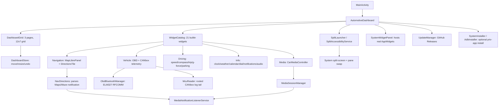

# Dashwheel - Android Car Launcher Project

## Project Overview

Dashwheel is a free-placement, widget-grid car launcher for Android — usable both as a Head Unit's Home launcher and as a standalone smartphone driving app. Built entirely with Jetpack Compose.

The dashboard is **three swipeable pages** of a 12×7 cell grid. Each cell can hold an app shortcut, a pair of apps launched side-by-side (split-screen), an editable app launch bar, a real Android AppWidget, or one of 21 built-in cards (navigation, OBD/vehicle telemetry, driving instruments, media, info & comms). Tiles are placed, dragged and resized freely, with collision-aware move/swap/nudge and full undo.

### Key Features
- **Free-placement widget dashboard**: 3 pages × 12×7 grid, drag-to-move / handle-to-resize tiles, 30-step undo, layout persisted as JSON
- **21 built-in widgets**: navigation map, Google/Waze directions, full OBD + CANbox telemetry (incl. DTC scan/clear), driving instruments (speed/compass/trip/g-force/parking), weather, calendar, quick-dial, notifications, audio, clock, and more — grouped by category in the widget catalogue
- **In-app navigation**: a free MapLibre GL map (CARTO basemap, Nominatim geocoding, Valhalla routing, 3D buildings) that hands off turn-by-turn to Google Maps/Waze; a Directions tile parses the live turn-by-turn notification from either app
- **OBD-II + CANbox telemetry**: ELM327 Bluetooth adapter for speed/RPM/coolant/intake/throttle/load/fuel/voltage plus DTC read & clear; an optional rooted CANbox (MCU) reader for door state and a learned fuel-level mapping, tuned for a Citroën C4 Picasso
- **System split-screen**: docks the dashboard and launches another app (or a saved pair) beside it via an Accessibility Service, with a swap button/overlay to flip which app is on which side
- **System AppWidget hosting**: embed real Android widgets (including ones like Google Maps' that Android normally hides from non-launcher pickers) inside dashboard tiles
- **12 visual themes**: Auto, Original, Aurora Glass, Neon Dark, Clean Light, Dark Glass, Sporty, Floating, plus four whole-design skins (Orbit, Cockpit, Horizon, Tape Deck) with their own backgrounds, top bars and widgets — switchable live from the theme picker
- **Phone link (Dashwheel Companion)**: with the phone sharing its connection over Wi-Fi, a small companion app on the phone sends its notifications and messages to the Notifications widget; read them aloud and answer with a quick reply or by voice (WhatsApp, Messages, Signal… through each app's own reply action, like Android Auto); incoming calls with caller name and photo, answer / decline / hang up from the screen; the phone also keeps where the car was left and a log of every drive (trip computer figures + eco-driving score). Paired once by scanning a QR code, end-to-end encrypted
- **Media Integration**: reads the active system media session (title, artist, artwork, playback) and exposes transport controls
- **Volume control + volume follows speed**: Settings → Driving → Volume control picks Automatic / Android / Volume keys (units whose MCU ignores Android's volume, like the ROCO K706, use the keys the wheel buttons send, via root or the internal ADB); Settings → Driving → Off / Low / Medium / High turns the music up from 40 km/h (OBD speed, GPS otherwise) and back down as the car slows, adding and removing only its own notches so the driver's volume changes are kept (`SpeedVolume.kt`)
- **In-App Auto-Update**: checks GitHub Releases on launch, tracks the installed version, and downloads/installs newer APKs
- **Optional priv-app install**: self-installs to `/system/priv-app` (via `su`/Magisk or the head unit's internal root ADB) to pick up `BIND_APPWIDGET` privileges and the split-swap overlay — opt-in only, not required
- **Root-only features stay out of the way**: everything that runs through `su` or the unit's internal ADB (system-app install, boot logo, app windows and the Maps window, volume keys, CANbox tiles and finders) is only offered once a privileged shell is found (`PrivilegedShell.kt`); on a phone or an unrooted unit those settings, catalogue entries and template tiles are hidden
- **Safety First**: dark themes by default, large touch targets, screen kept on while driving

### Project Structure

```
D:/android car launcher/
├── build.gradle.kts                              # Root build: AGP 8.13.2 + Kotlin 2.1.0 plugin versions
├── settings.gradle.kts                           # Project + repositories
├── gradle.properties                             # AndroidX / Gradle flags
├── gradlew, gradlew.bat                           # Gradle wrapper scripts
├── gradle/wrapper/gradle-wrapper.properties       # Pins Gradle 8.13 (jar generated on first sync/CI)
├── app/
│   ├── build.gradle.kts                           # Module dependencies & Android config
│   ├── proguard-rules.pro
│   └── src/main/
│       ├── AndroidManifest.xml                    # Launcher + HOME filters, permissions, services
│       ├── java/com/openauto/dash/
│       │   ├── MainActivity.kt                    # Entry point, wake flags, multi-window tracking
│       │   ├── AutomotiveDashboard.kt             # Root composable: pages, undo, OBD loop, dialogs
│       │   ├── DashboardModel.kt                  # Grid model, DashboardItem/BuiltinKind, persistence
│       │   ├── DashboardGrid.kt                   # Grid rendering, drag-move / drag-resize gestures
│       │   ├── WidgetCatalog.kt                   # "+" add-widget picker, grouped by category
│       │   ├── AppLauncher.kt / AppTiles.kt       # App enumeration + full-screen app drawer
│       │   ├── TopBar.kt                          # Minimal bar: Apps, layout menu, clock, OBD dot, ⋮ menu
│       │   ├── DashTheme.kt / DashThemePickerDialog.kt  # 12 palettes (incl. Aurora Glass) + picker UI
│       │   ├── Skins.kt / SkinKit.kt              # Skin dispatch (background, top bar, widgets, Maps frame) + shared live values
│       │   ├── OrbitSkin.kt / CockpitSkin.kt / HorizonSkin.kt / TapeDeckSkin.kt  # The four whole-design skins
│       │   ├── WindowFrameOverlay.kt              # Skin frame drawn in an overlay window over the docked Google Maps window
│       │   ├── OriginalTiles.kt                   # Legacy widget renderers used by the "Original" theme
│       │   ├── MapLibrePanel.kt                   # In-app MapLibre GL navigator (free, no API key)
│       │   ├── DirectionsTile.kt / NavDirections.kt # Google Maps/Waze turn-by-turn via notification parsing
│       │   ├── ObdBluetoothManager.kt / ObdParser.kt / ObdCodes.kt # ELM327 link, pure reply decoding, DTC table
│       │   ├── McuReader.kt                       # Rooted CANbox reader: doors, learned fuel mapping
│       │   ├── TelemetryTiles.kt / VehicleTiles.kt / DriveTiles.kt # OBD/CANbox/driving-instrument cards
│       │   ├── CarMediaController.kt / MediaTile.kt # MediaSessionManager bridge + media card
│       │   ├── MediaNotificationListenerService.kt  # Shared listener: media + directions + notifications
│       │   ├── InfoTiles.kt / WeatherRepo.kt       # Clock/weather/calendar/dial/notifications/audio cards
│       │   ├── SystemWidgetPanel.kt               # Hosts real Android AppWidgets inside dashboard tiles
│       │   ├── SplitLauncher.kt / SplitAccessibilityService.kt # System split-screen + pane swap
│       │   ├── AdbInstaller.kt / SystemInstaller.kt # Optional priv-app self-install (Magisk / root ADB)
│       │   ├── PhoneLink.kt / PhoneLinkUi.kt       # Phone link: dials the companion app on the hotspot, reply sheet, pairing QR
│       │   ├── PhoneCallOverlay.kt                # The phone's calls: caller card with answer / decline / hang up, over any app
│       │   ├── DriveLog.kt                        # Drive log: each trip + its eco-driving score, saved and sent to the phone
│       │   ├── UpdateManager.kt                   # GitHub Releases auto-update
│       │   └── AutoDriveReceiver.kt               # Auto-launch on Bluetooth connect (see Troubleshooting)
│       └── res/
│           ├── drawable/                          # Vector icons + adaptive-icon layers
│           ├── mipmap-anydpi-v26/ic_launcher.xml  # Adaptive launcher icon (+ ic_launcher_round)
│           ├── values/                            # colors.xml, themes.xml, strings.xml
│           └── xml/                               # file_paths.xml, split_accessibility_config.xml
│   └── src/test/java/com/openauto/dash/       # JVM unit tests: grid, OBD decoding, directions, layout JSON
├── companion/                                    # Dashwheel Companion, the phone app (notification listener + link server)
├── link/                                         # Plain-Kotlin protocol shared by both apps: messages, pairing, encrypted channel (+ tests)
└── .github/workflows/                            # GitHub Actions CI/CD
    ├── build.yml                                 # Builds + releases the APK on push to main
    └── lint.yml                                  # Android Lint + unit tests
```

## Toolchain

| Tool | Version |
|------|---------|
| Android Gradle Plugin | 8.13.2 |
| Gradle | 8.13 |
| Kotlin | 2.1.0 (+ Compose compiler plugin) |
| compileSdk | 35 |
| targetSdk | 34 |
| minSdk | 29 (Android 10) |
| Gradle JDK | 17–21 (see note) |

> **JDK note:** AGP 8.13.2 / Gradle 8.13 run on JDK 17–21, not JDK 25. The latest Android Studio bundles JBR 25 for the IDE, but the **Gradle JDK** is a separate, per-project setting. If Studio flags "Java 25 is not supported", set **Settings → Build, Execution, Deployment → Build Tools → Gradle → Gradle JDK → Download JDK → 21** and re-sync. The IDE keeps using JBR 25; only the Gradle daemon uses 21.

## Setup Instructions

### Prerequisites
1. **Android Studio (latest)** with a **Gradle JDK of 17–21** (Studio can download it)
2. **Android SDK** (platform 35, build-tools 35, platform-tools)

### Building with Android Studio
1. Open `D:/android car launcher` in Android Studio.
2. Let Gradle sync — this downloads dependencies and generates the Gradle wrapper JAR automatically. If it complains about Java 25, set the Gradle JDK to 21 (see the JDK note above) and re-sync.
3. Build the debug APK: `Build → Build Bundle(s) / APK(s) → Build APK(s)`.
4. Install `app/build/outputs/apk/debug/app-debug.apk` on a device or emulator.

### Building from the command line
The wrapper JAR (`gradle/wrapper/gradle-wrapper.jar`) is intentionally **not** committed. Generate it once with a locally installed Gradle (8.13), or let Android Studio create it on first sync:

```bash
gradle wrapper --gradle-version 8.13
```

Then build:

```bash
./gradlew assembleDebug
```

On Windows PowerShell use `.\gradlew.bat assembleDebug`. The output APK is at `app/build/outputs/apk/debug/app-debug.apk`.

> If you don't want to install Gradle locally at all, just push to GitHub — the CI build below provisions Gradle, generates the wrapper, and produces the APK for you.

## Features Overview

### 1. Dashboard Grid — 3 Pages, Free Placement
`AutomotiveDashboard` owns three swipeable "virtual desktop" pages, each a 12×7 cell grid (`DashboardModel.kt`). Tiles are placed, long-press-dragged to move, or resized via a corner handle (`DashboardGrid.kt`), with live snap-preview and collision-aware move/swap/nudge (`DashboardStore.moveResolving`). Layouts persist as JSON in SharedPreferences and survive app restarts; up to 30 steps of undo are kept in memory. Tapping the **"+"** tile opens the add flow: an app shortcut, a split-screen app pair, an editable launch bar, a widget from the catalogue, or a hosted system AppWidget.

While the launcher shares the screen with another app (system split-screen), pages automatically switch to a stacked vertical-scroll layout instead of the free grid.

### 2. Widget Catalogue (21 built-in cards)
`WidgetCatalog.kt` groups every built-in widget by category:
- **Driving**: speed HUD, compass, trip computer, g-force meter, parking-spot finder
- **Navigation**: in-app MapLibre map, Google/Waze directions tile, Maps window dock (pins the floating Maps PiP onto a tile via the head unit's ADB socket)
- **Vehicle**: OBD telemetry, OBD DTC scan/clear, all-OBD-values, fuel/range, door state, CAN signal monitor
- **Info & Comms**: clock, weather, calendar, quick-dial, notifications, audio
- **Media & Apps**: media player, app launch bar

### 3. In-App Navigation & Directions
`MapLibrePanel.kt` is a free, no-API-key in-app navigator: MapLibre GL rendering over the CARTO dark-matter basemap, Nominatim geocoding, Valhalla routing, and 3D building extrusion, with a GPS-tracking camera. Tapping **Start** hands off turn-by-turn guidance to Google Maps via the free `google.navigation:` intent (falling back to a generic `geo:` intent) — full embedded Google Maps was attempted but abandoned since embedding requires platform signing.

`NavDirections.kt` reads the ongoing turn-by-turn notification Google Maps/Waze post while navigating (via the same notification-listener service used for media) and parses instruction text, distance and ETA — even when the notification uses a custom RemoteViews layout with empty extras. `DirectionsTile.kt` renders this as a full card or as a compact banner floated over the map tile.

### 4. OBD-II + CANbox Vehicle Telemetry
`ObdBluetoothManager.kt` connects to an ELM327 adapter over Bluetooth SPP/RFCOMM and polls every 500ms: speed, RPM, coolant/intake temp, throttle, engine load, fuel level, and control-module voltage, plus **DTC read & clear** (mode 03/04) with human-readable descriptions from `ObdCodes.kt` (extra detail for Citroën C4 Picasso VTi/THP/HDi engines).

`McuReader.kt` optionally taps the head unit's CANbox/MCU (requires root, tails `logcat -s mcu_services`) to expose live door/bonnet/tailgate state and a user-calibrated fuel-level mapping for vehicles whose OBD doesn't report fuel.

### 5. System Media Integration
`CarMediaController.kt` bridges Android's `MediaSessionManager` into a `StateFlow<MediaState>`, auto-selecting whichever session is actually playing, exposing title/artist/artwork/duration and Play/Pause/Next/Previous transport controls. Reading other apps' sessions requires **Notification access**, granted once via system settings — the same listener service also powers the Directions tile and a general notifications feed.

### 6. System Split-Screen + Pane Swap
This head unit's ROM ignores AOSP windowing APIs but honors SystemUI's manual recents-drag split path, so `SplitLauncher.kt` drives it via an `AccessibilityService` (`SplitAccessibilityService.kt`, enabled once under Settings → Accessibility): it triggers the same global action a manual split gesture would, then launches the target app (or a saved pair) adjacent to the dashboard. A floating overlay button (or a FAB in the dashboard) lets you swap which app occupies which side, since this ROM has no working divider double-tap swap gesture.

### 7. Optional Priv-App Install
`SystemInstaller.kt`/`AdbInstaller.kt` can self-install the APK into `/system/priv-app`, either via `su`/Magisk (preferring a systemless Magisk module) or by talking to the head unit's internal root ADB socket. This is opt-in only (from ⋮ → System app in the top bar), mainly useful for the `BIND_APPWIDGET` priv-app permission and the split-swap overlay window — it does **not** enable embedding Google Maps.

### 8. Phone Link (Dashwheel Companion)
The driver's phone shares its connection with the head unit over Wi-Fi. **Dashwheel Companion** (`companion/`, shipped as `dashwheel-companion.apk` in every release) runs on the phone:
- A `NotificationListenerService` reads the phone's notifications, including messaging conversations (`MessagingStyle`), and answers them through each app's own reply / mark-as-read actions (`RemoteInput`), the same ones Android Auto and smartwatches use.
- A foreground service listens on TCP port 47810. The launcher's `PhoneLink` finds the phone at the Wi-Fi network's default gateway (Android 11+ randomises the hotspot subnet), dials it, and redials whenever the network changes.
- **Pairing**: Settings → Phone → *Pair a phone* shows a QR code (`dashwheel://pair?…`) carrying a random 32-byte secret. The phone scans it and the driver confirms. Every connection then proves both sides hold that secret (HMAC over the handshake), agrees fresh keys with ephemeral ECDH P-256, and encrypts every frame with AES-256-GCM (`link/`, unit-tested). Either side can revoke the pairing.
- On the head unit, the phone's notifications join the Notifications widget. Tapping one opens a sheet to read it aloud, answer with a quick reply or dictation, mark it read or clear it on the phone.
- **Calls**: the companion follows the phone's call state (`PHONE_STATE`), finds the caller in the contacts, and answers or ends the call through `TelecomManager` when asked (`PhoneCalls.kt`). Calls **in an app** (WhatsApp, Signal, Telegram, Messenger…) never reach the phone's call state, so the companion reads them from the app's own call notification (`CallNotification.kt`, through the notification listener: Notification access is what makes them show) and answers / declines / hangs up with the buttons that notification carries (Android 12's CallStyle intents, else the actions told apart by their titles). On phones where such a call also reaches the call state (a Samsung), nameless and without a number, the app's notification wins: it knows the caller, and Telecom ignores answer / end requests for a call it doesn't manage. The companion's status line says which of the two the car was told. On the head unit, `PhoneCallOverlay` shows a card with the caller, *Answer* and *Decline*, then a slim bar with the duration and *Hang up*. It is its own overlay window, so it appears over any full-screen app (needs "display over other apps", granted through the head unit's shell when possible, otherwise from Settings → Phone); without it, a popup over the launcher. The call's **sound stays on the head unit's Bluetooth hands-free**: pair the phone with the head unit's Bluetooth as well.

- **Where's my car**: every place the car comes to a stop (and the spot saved on the Parking tile) is sent to the phone (`CarWhereabouts.kt`); the companion shows the last one with *Map* and *Walk there*.
- **Drive log**: the head unit logs each drive as the Trip tile counted it (distance, time, moving time, average and top speed) together with the Eco driving card's verdict (score, revs in the relaxed band, hard accelerations / brakings, fuel estimate at the car's usual consumption and the driver's fuel price). A drive ends by itself after ten minutes standing still, when the engine has been off long enough for the eco card to close its drive (OBD), or when the driver resets the Trip tile; the trip under way is saved every half minute, so a unit switched off mid-drive carries it on when it comes back within those ten minutes (`DriveLog.kt`, last 50 drives). While linked, the drive under way is reported to the phone as it goes and once more when it ends, and the whole log is sent when the link comes up; the companion keeps the last 100 in its **Drives** section (`DriveJournal.kt`).

On Android 13+, a sideloaded app's Notification access is a "restricted setting": on the phone, open App info → ⋮ → *Allow restricted settings* first. The companion app shows this step.

### 9. In-App Auto-Update
`UpdateManager` keeps the app current from GitHub Releases:
- On launch it queries `https://api.github.com/repos/deviloufr-ai/ACP/releases/latest`.
- **Version tracking**: the installed `versionCode` is set by CI to the Actions **run number**; the latest build number is parsed from the release tag (`v1.0.42` → `42`). A higher number means an update is available.
- If newer, a banner offers **Update** → it downloads the release's launcher APK (never `dashwheel-companion.apk`) via `DownloadManager` and launches the system installer (Android always shows its own install confirmation).
- The current version is shown in the top status bar.

> Android cannot install silently without device-owner privileges, so "auto-update" means auto-check + auto-download + a one-tap, OS-confirmed install. The first time, the user must allow "install unknown apps" for Dashwheel (the app opens that settings screen for them).

**Important — signing:** an update APK can only replace the installed app if both are signed with the **same key**. CI's debug key is regenerated every run, so you must add a persistent release keystore (below) for updates to actually install over each other.

#### Release signing setup (required for OTA updates)
1. Generate a keystore once:
   ```bash
   keytool -genkeypair -v -keystore release.keystore -alias openauto \
     -keyalg RSA -keysize 2048 -validity 10000
   ```
2. Base64-encode it:
   ```bash
   base64 -w0 release.keystore > release.keystore.b64   # Linux
   # macOS: base64 -i release.keystore -o release.keystore.b64
   ```
3. In the GitHub repo, add **Settings → Secrets and variables → Actions**:
   - `KEYSTORE_BASE64` — contents of `release.keystore.b64`
   - `KEYSTORE_PASSWORD` — the store password
   - `KEY_ALIAS` — `openauto`
   - `KEY_PASSWORD` — the key password

When these secrets are present, CI signs every release APK with that key; when they are absent, it falls back to the debug key (installs fine, but cross-version updates won't).

### 10. Theming
`DashTheme.kt` provides 12 selectable themes, switchable live from the theme picker (`DashThemePickerDialog.kt`): **Auto** (follows system day/night), **Original** (the first launcher look — flat cards, twin-needle gauges, rendered by `OriginalTiles.kt`), **Aurora Glass** (glass panels, glowing gauges, cyan/violet gradient), **Neon Dark**, **Clean Light**, **Dark Glass**, **Sporty** (black + red) and **Floating** (no tile backgrounds).

Four more are whole-design **skins** (`DashSkin`): **Orbit** (everything round: a spinning record, ring gauges, bubbles), **Cockpit** (chrome-ringed analog dials and toggle switches on stitched leather), **Horizon** (no widgets, just an evening scene with the road ahead and typography on it) and **Tape Deck** (80s synthwave head unit: cassette, neon grid, seven-segment digits). A skin draws its own page background, top bar and the main widgets (speed, telemetry, music, directions, clock, weather, fuel, app shortcuts, launch bar); `Skins.kt` routes those tiles to the skin's file and every other tile keeps its standard renderer on the skin's palette. When Google Maps is docked, the skin also shapes and decorates it (a round porthole, a chrome bezel, a CRT bezel, a soft fade) from an overlay window above it (`WindowFrameOverlay.kt`); touches pass straight through to Maps.

## Architecture



## Safety Guidelines
- **Dark Themes by Default**: Auto/Aurora/Neon/Dark Glass/Sporty all reduce glare while driving.
- **High-Contrast Controls**: large touch targets throughout the grid and media transport.
- **Screen Kept On**: the screen stays awake while the dashboard is active.
- **Large Typography**: hero telemetry (speed, distance-to-turn) uses oversized readouts with warning thresholds.

## Permissions Required

| Permission | Purpose |
|------------|---------|
| BLUETOOTH / BLUETOOTH_ADMIN / BLUETOOTH_CONNECT | OBD-II adapter connection |
| ACCESS_FINE_LOCATION / ACCESS_COARSE_LOCATION | In-app navigation, weather, driving-instrument widgets |
| READ_CALENDAR | Calendar widget (requested at runtime when added) |
| READ_CONTACTS | Quick Dial widget (requested at runtime when added) |
| INTERNET | Map tiles, weather, media, updates |
| WAKE_LOCK / DISABLE_KEYGUARD | Keep screen on while driving |
| FOREGROUND_SERVICE / FOREGROUND_SERVICE_DATA_SYNC | Continuous telemetry |
| POST_NOTIFICATIONS | Notifications on Android 13+ |
| REQUEST_INSTALL_PACKAGES | Install downloaded update APKs |
| BIND_APPWIDGET | Hosting real Android AppWidgets in dashboard tiles |
| SYSTEM_ALERT_WINDOW | Floating split-screen swap button; the skins' frame over the docked Maps window (granted through the dock's shell when missing) |
| Notification access (granted in Settings) | Read media sessions, parse Maps/Waze directions, general notifications feed |
| Accessibility service (granted in Settings, optional) | Drive system split-screen + pane swap |

## GitHub Actions CI/CD

The project builds automatically on GitHub Actions — no local Android Studio required.

### Workflow Files
- **`.github/workflows/build.yml`** — builds the **release** APK, uploads it as an artifact, and (on push to `main`) publishes a **GitHub Release** the in-app updater reads.
- **`.github/workflows/lint.yml`** — runs Android Lint and unit tests.

### How It Works
Each build job: checkout → set up JDK 21 → set up Android SDK (explicit packages, no obsolete `tools`) → **set up Gradle 8.13** → `gradle wrapper` → decode the optional signing key → `./gradlew assembleRelease` (with `VERSION_CODE`/`VERSION_NAME` from the run number) → upload artifact → publish a release tagged `v1.0.<run_number>` with the APK attached. Because CI provisions Gradle itself, the wrapper JAR is not committed.

### Get the APK
- **Latest release** (what the app auto-updates from): https://github.com/deviloufr-ai/ACP/releases/latest
- **Per-run artifact**: Actions tab → a successful run → `openauto-dash-apk`.
- Install on a device: `adb install app-release.apk`

## Troubleshooting

### OBD-II Connection Issues
1. Pair the ELM327 adapter with the phone in Bluetooth settings first.
2. Grant Bluetooth permission when the app prompts (Android 12+).
3. Ensure the adapter's name contains `OBD`, `ELM`, or `327` so auto-detect finds it.
4. Confirm it works with a known OBD-II app before debugging here.

### Media / Directions / Notifications Not Working
1. Play audio/video from a supported app, or start turn-by-turn in Google Maps/Waze, so there is an active notification to read.
2. Open the widget's **Grant Media Access** action and enable Notification access for Dashwheel — this one grant powers media, directions, and the notifications feed.
3. Return to the app — the relevant tile should populate.

### Split-Screen / Swap Not Working
1. Enable the accessibility service once under **Settings → Accessibility → Dashwheel**.
2. If the service isn't enabled, split launches fall back to a movable freeform window instead of true split-screen.
3. The swap overlay button needs `SYSTEM_ALERT_WINDOW`; installing as a priv-app auto-grants this on some ROMs.

### Auto-Launch on Bluetooth Connect Is Unreliable
`AutoDriveReceiver` listens for `ACTION_ACL_CONNECTED`, but Android 8+ (this app targets `minSdk 29`) no longer delivers most implicit broadcasts to manifest-declared receivers — this only works if the app process is already running. Treat it as a best-effort convenience, not a guaranteed auto-launch.

## License
Created for educational and demonstration purposes.

## Support
- [Jetpack Compose Guidelines](https://developer.android.com/jetpack/compose)
- [OBD-II PIDs](https://en.wikipedia.org/wiki/OBD-II_PIDs)
- [MediaSessionManager](https://developer.android.com/reference/android/media/session/MediaSessionManager)
- [MapLibre GL Android SDK](https://maplibre.org/maplibre-native/android/)

---

**Project Status**: Compiles to a debug/release APK via Gradle/CI; actively evolving, in on-device integration testing on a real head unit.

**Last Updated**: 2026-09-22
